# ResumeIQ

A production-grade AI resume analyzer that feels less like a repo and more like a product.

**Live Demo:**  
https://resumeiq-ai-resume-analyzer-x9rvr.puter.site/

ResumeIQ is an end-to-end, browser-native resume analysis platform. It allows users to upload resumes, evaluate them against real job context, and receive structured feedback, ATS scoring, and actionable improvement suggestions in real time.

Everything runs client-side using modern frontend tooling and browser-based AI. No traditional backend is required.

---

## Screenshots

### Landing & Onboarding

<p align="center">
  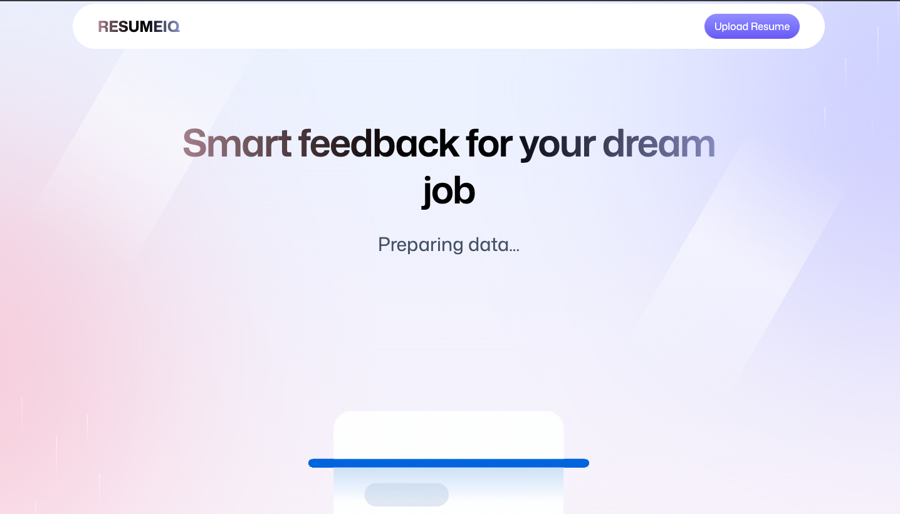
</p>

<p align="center">
  
</p>

---

### Resume Context & Upload Flow

<p align="center">
  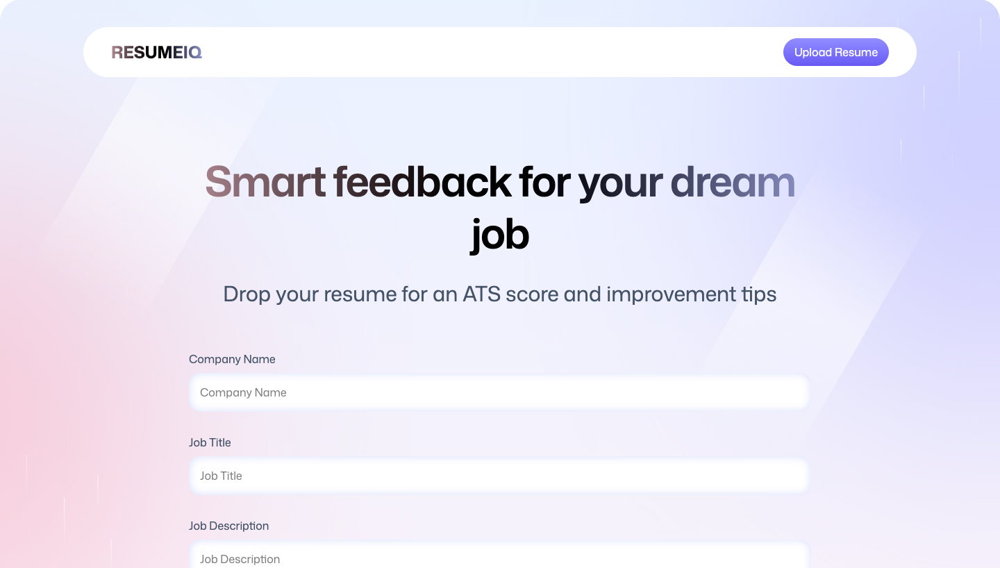
</p>

<p align="center">
  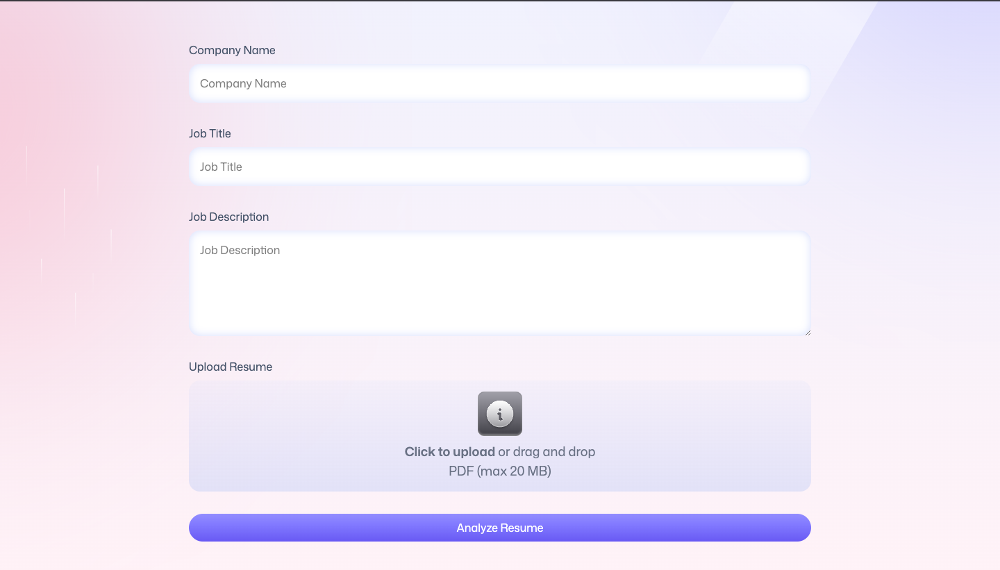
</p>

<p align="center">
  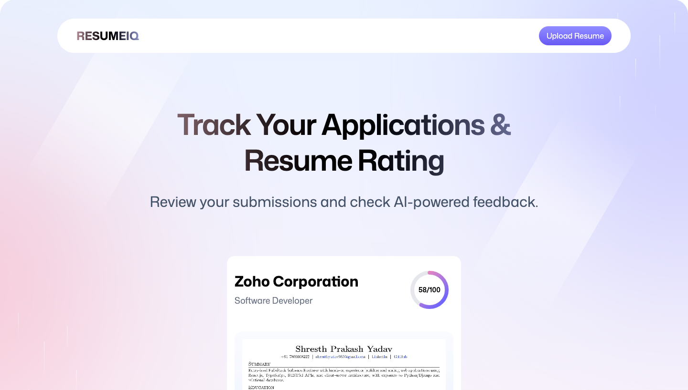
</p>

<p align="center">
  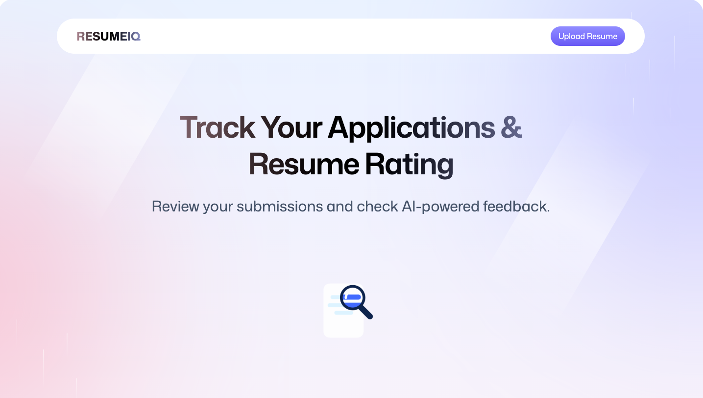
</p>

<p align="center">
  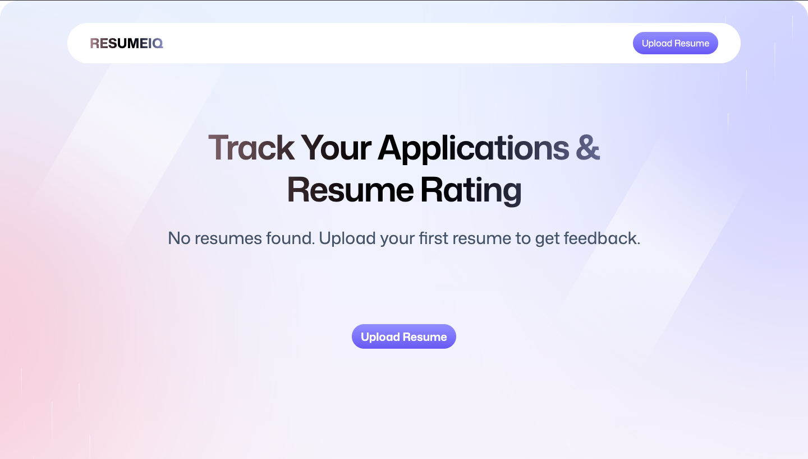
</p>

---

### Resume Processing

<p align="center">
  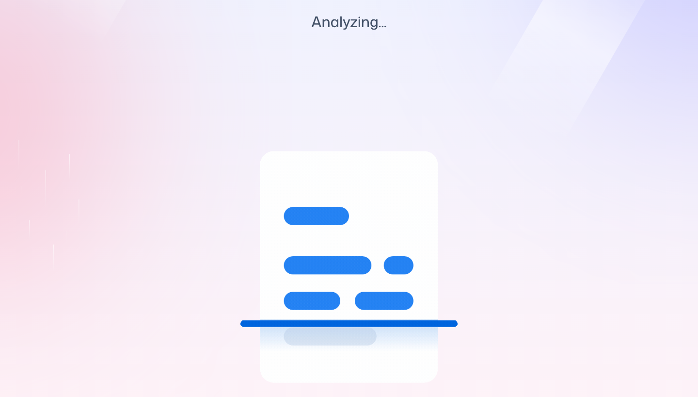
</p>

---

### Resume Review & Scoring

<p align="center">
  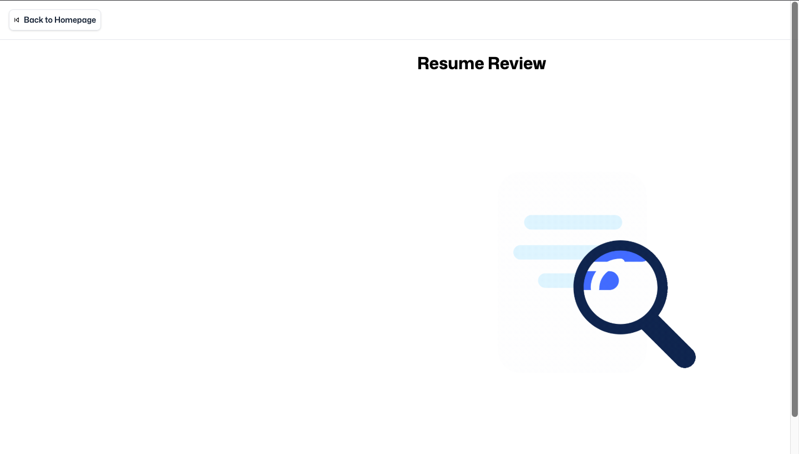
</p>

<p align="center">
  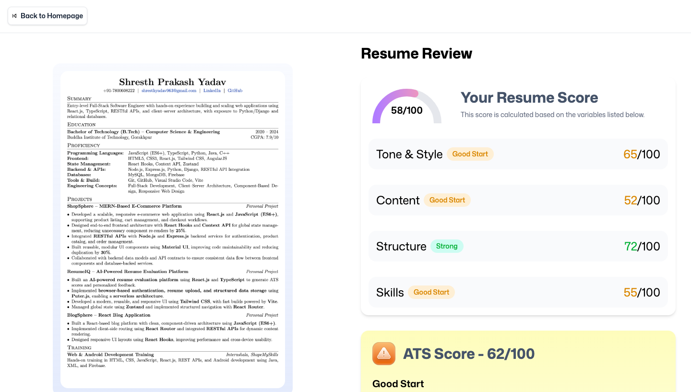
</p>

<p align="center">
  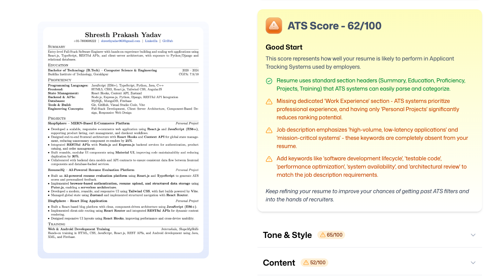
</p>

<p align="center">
  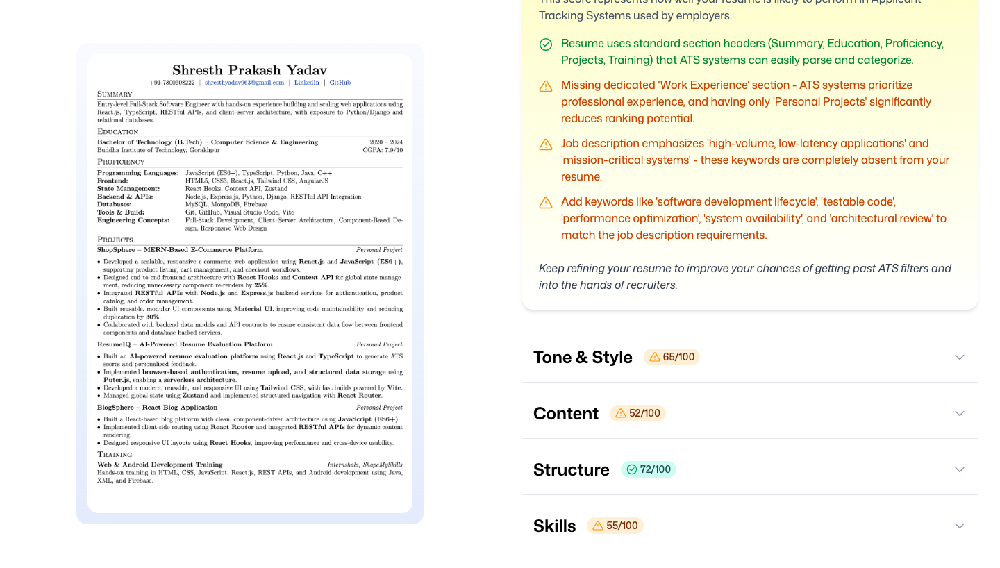
</p>

---

### Session & Account State

<p align="center">
  
</p>

---

## Features

- Resume upload (PDF, DOCX, TXT)
- Job-aware analysis using company name, role, and description
- AI-generated scoring across:
  - Tone & Style  
  - Content quality  
  - Structure  
  - Skills coverage  
- ATS compatibility scoring with concrete suggestions
- Fully client-side processing
- Responsive, production-grade UI

---

## System Architecture

ResumeIQ is designed as a frontend-first system:

- **UI:** React + TypeScript  
- **Build Tool:** Vite  
- **Routing:** React Router  
- **AI & File Handling:** Browser-native APIs and Puter.js  
- **Styling:** Utility-first CSS  
- **Deployment:** Static hosting on Puter  

All resume parsing, scoring, and AI interaction occurs in the browser. No external backend or database is required.

---

## Local Development

### Prerequisites

- Node.js 18+

### Setup

```bash
git clone git@github.com:Shresth-yadav/ResumeIQ.git
cd ResumeIQ
npm install